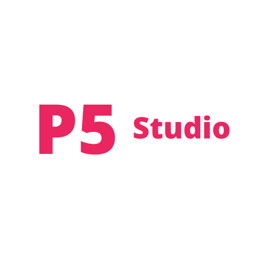

<a href="https://p5-studio.vercel.app/">

</a>

<a href="https://p5-studio.vercel.app/">
P5 Studio Docs
</a>

P5 Studio is a repository that contains all the tools that you need to start making <a href="https://p5js.org/">p5.js</a> apps. Currently we are working on [P5 Studio Creator](https://github.com/Andy-Python-Programmer/p5-studio/tree/master/creator) that is a cli app that you can download using [npm](https://www.npmjs.com/package/p5-studio-creator) and use it to create p5.js projects easily.
