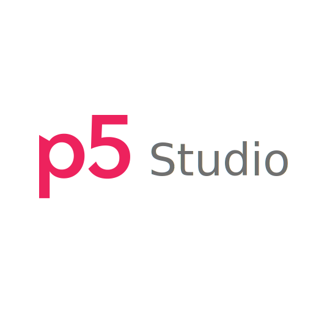

<a href="https://andy-python-programmer.github.io/p5-studio/">
P5 Studio Docs
</a>

P5 Studio is a repository that contains all the tools that you need to start making <a href="https://p5js.org/">p5.js</a> apps. Currently we are working on P5 Studio Creator that is a cli app that you can download using npm and use it to create p5.js projects easily.
